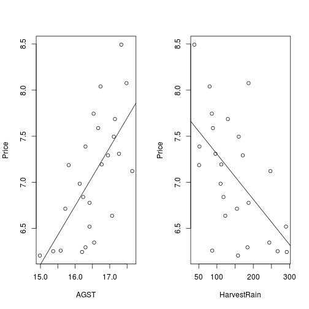
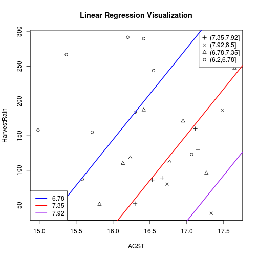

# Wine Price Prediction Using Linear Regression

## Synopsis
The data gives the wine prices and other factors. A linear regression analysis is used to predict wine's price. 
## Download Data


```r
wine = read.csv('wine.csv')
wineTest = read.csv('wine_test.csv')
names(wine)
```

```
## [1] "Year"        "Price"       "WinterRain"  "AGST"        "HarvestRain"
## [6] "Age"         "FrancePop"
```
For each elements, a scatter plot is made to show the relation between price and the factor. Both AGST and HarvestRain show the highest influences over the French wine price. 

```r
par(mfrow = c(1, 2))
model1 = lm(Price~AGST, data=wine)
with(wine, plot(AGST, Price))
abline(model1)

model1 = lm(Price~HarvestRain, data=wine)
with(wine, plot(HarvestRain, Price))
abline(model1)
```

 
## Linear Regression

Now consider AGST and HarvestRain both as variables to predict the wine price using linear regression. 


```r
model2 = lm(Price~AGST+HarvestRain, data=wine)
predictTest = predict(model2, newdata=wineTest)
```
Model2 with AGST and HarvestRain is better than Model1 with only AGST, which is shown through the increasing of adjusted R-squared. The perfect model would have adjusted R-squared as 1.0.  

```r
summary(model1)
```

```
## 
## Call:
## lm(formula = Price ~ HarvestRain, data = wine)
## 
## Residuals:
##     Min      1Q  Median      3Q     Max 
## -1.1116 -0.3228 -0.1008  0.3691  1.1977 
## 
## Coefficients:
##              Estimate Std. Error t value Pr(>|t|)    
## (Intercept)  7.798553   0.249153   31.30  < 2e-16 ***
## HarvestRain -0.004923   0.001506   -3.27  0.00337 ** 
## ---
## Signif. codes:  0 '***' 0.001 '**' 0.01 '*' 0.05 '.' 0.1 ' ' 1
## 
## Residual standard error: 0.5489 on 23 degrees of freedom
## Multiple R-squared:  0.3173,	Adjusted R-squared:  0.2877 
## F-statistic: 10.69 on 1 and 23 DF,  p-value: 0.003366
```

```r
summary(model2)
```

```
## 
## Call:
## lm(formula = Price ~ AGST + HarvestRain, data = wine)
## 
## Residuals:
##      Min       1Q   Median       3Q      Max 
## -0.88321 -0.19600  0.06178  0.15379  0.59722 
## 
## Coefficients:
##             Estimate Std. Error t value Pr(>|t|)    
## (Intercept) -2.20265    1.85443  -1.188 0.247585    
## AGST         0.60262    0.11128   5.415 1.94e-05 ***
## HarvestRain -0.00457    0.00101  -4.525 0.000167 ***
## ---
## Signif. codes:  0 '***' 0.001 '**' 0.01 '*' 0.05 '.' 0.1 ' ' 1
## 
## Residual standard error: 0.3674 on 22 degrees of freedom
## Multiple R-squared:  0.7074,	Adjusted R-squared:  0.6808 
## F-statistic: 26.59 on 2 and 22 DF,  p-value: 1.347e-06
```


```r
#===============Plotting Results==============
# cut the wine price into 4 bins just to show the relationship of Price vs AGST and HarvestRain.
wine$PriceRange = cut(wine$Price, 4)
with(wine, plot(AGST, HarvestRain, pch=unclass(wine$PriceRange)))
legend('topright', pch=unique(unclass(wine$PriceRange)), legend = unique(wine$PriceRange))
# pick up three binning points for prices. The goal is to draw the division lines of price range using linear regression results
q = c(6.78, 7.35, 7.92)
theta= coef(model2)
abline(coef = c((theta[1]-q[1])/(-1.0*theta[3]), theta[2]/(-1*theta[3])), col='blue', lwd= 2.0)
abline(coef = c((theta[1]-q[2])/(-1.0*theta[3]), theta[2]/(-1*theta[3])), col='red', lwd= 2.0)
abline(coef = c((theta[1]-q[3])/(-1.0*theta[3]), theta[2]/(-1*theta[3])), col='purple', lwd= 2.0)
legend('bottomleft', lwd = 2.0, 
lty = 1.0, col = c('blue', 'red', 'purple'), legend = q)
title('Linear Regression Visualization')
```

 
