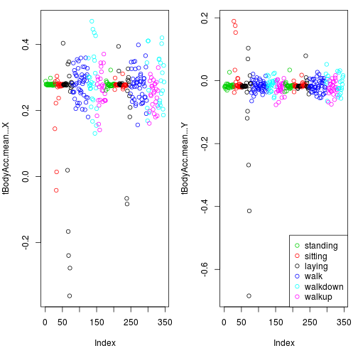
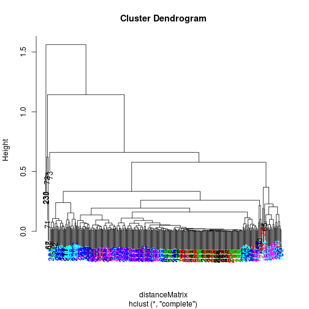
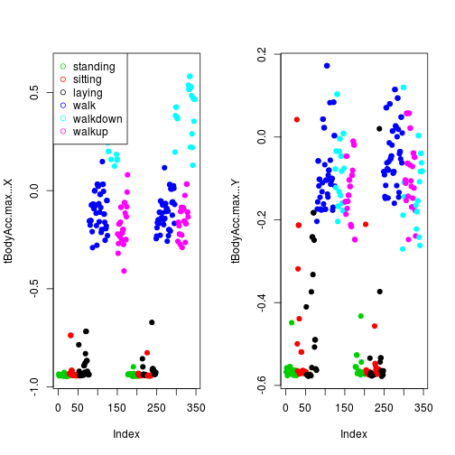
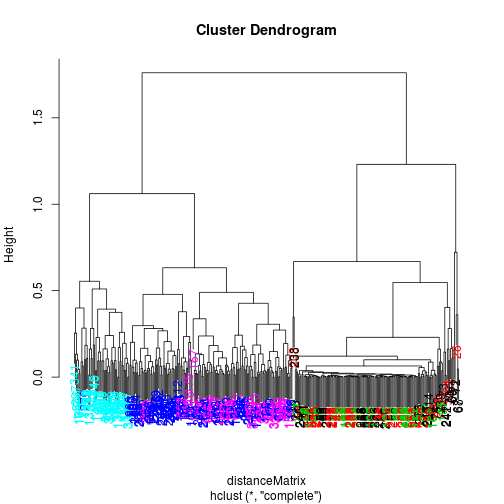
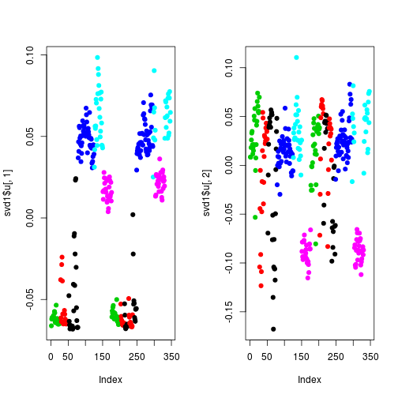
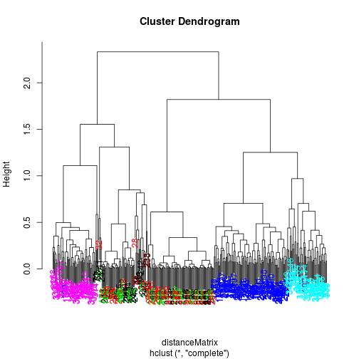
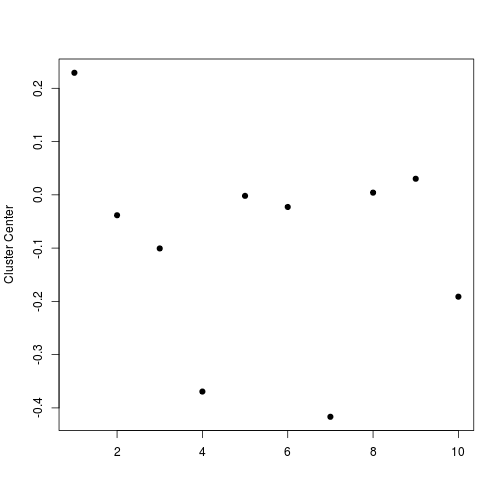
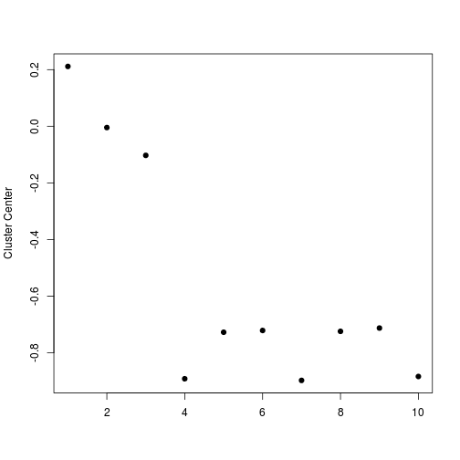

# Exploratory Data Analysis - Case Study Demo

This note is to mark out my understanding of Prof Roger D. Peng's lecture: Clustering Case Study, Exploratory Anlaysis. I personally think this analysis is very well done and decided to add my own understanding to the notes for future reference. 

The samsung data is downloaded from: [samsungData.rda](https://d396qusza40orc.cloudfront.net/exdata/data/clusteringEx_data.zip)
The data is about using Samsung Galaxy to track human activities by measuring motions as acceleration and rotation. On the Samsung Galaxy, there are accelerometer in the gyroscope. In this notes, clustering is used to explore the structure of the data.

## 1. Download the data
<span style='color:steelblue'>file.exists</span> is used to check whether the data file already exists. In this way, repetative downloading would not happen. 

```r
if(!file.exists('./samsungData.rda')){
	url = 'https://d396qusza40orc.cloudfront.net/exdata/data/clusteringEx_data.zip'
	download.file(url, 'data.zip', method = 'curl')
	unzip('data.zip')
	file.remove('data.zip')
	file.copy('./data/samsungData.rda', './samsungData.rda')
	# unlink here is to delete the folder './data'
	unlink('./data', recursive=T)
}
# 'rda' is short for .RData. It is the usual format for saving R objects
# with save() or save.image()
# load() is used to reload the rda file.
load('./samsungData.rda')
```
## 2. Basic Data Structure
The data has <span style='color:red'>7352</span> records and <span style='color:red'>563</span> variables.

```r
dim(samsungData)
```

```
## [1] 7352  563
```
The first 18 variables are listed out:

```r
names(samsungData)[1:18]
```

```
##  [1] "tBodyAcc-mean()-X"   "tBodyAcc-mean()-Y"   "tBodyAcc-mean()-Z"  
##  [4] "tBodyAcc-std()-X"    "tBodyAcc-std()-Y"    "tBodyAcc-std()-Z"   
##  [7] "tBodyAcc-mad()-X"    "tBodyAcc-mad()-Y"    "tBodyAcc-mad()-Z"   
## [10] "tBodyAcc-max()-X"    "tBodyAcc-max()-Y"    "tBodyAcc-max()-Z"   
## [13] "tBodyAcc-min()-X"    "tBodyAcc-min()-Y"    "tBodyAcc-min()-Z"   
## [16] "tBodyAcc-sma()"      "tBodyAcc-energy()-X" "tBodyAcc-energy()-Y"
```
There are 6 activities: laying, sitting, standing, walking, walking down, walking up.

```r
table(samsungData$activity)
```

```
## 
##   laying  sitting standing     walk walkdown   walkup 
##     1407     1286     1374     1226      986     1073
```
## 3. Plotting avarage acceleration for first subject

The mean body acceleration is not interesting for standing, sitting, and laying. Walking, walking down and walking up have some variability on the x and y mean acceleration. 

```r
par(mfrow = c(1, 2), mar=c(5, 4, 1, 1))
samsungData = transform(samsungData, activity = factor(activity))
# For this analysis only subset data with subject == 1 is chosen
sub1 = subset(samsungData, subject == 1)
#names(sub1)[1:12]
plot(sub1[, 1], col = sub1$activity, ylab=names(sub1)[1])
plot(sub1[, 2], col = sub1$activity, ylab=names(sub1)[2])
legend('bottomright', legend = unique(sub1$activity), col = unique(sub1$activity), pch=1)
```

 
### Clustering based on mean acceleration

The clustering shows very little patterns of the data to distinguish motions. 


```r
distanceMatrix = dist(sub1[, 1:3])
hclustering = hclust(distanceMatrix)
source('myplclust.r')
myplclust(hclustering, lab.col = unclass(sub1$activity))
```

 
## 4. Plotting max acceleration for the first subjevct
The max acceleration can roughly tell moving from non-moving activities. 

```r
par(mfrow = c(1, 2))
plot(sub1[, 10], pch=19, col = sub1$activity, ylab=names(sub1)[10])
legend('topleft', legend = unique(sub1$activity), col=unique(sub1$activity), pch=1)
plot(sub1[, 11], pch=19, col = sub1$activity, ylab=names(sub1)[11])
```

 
### Clustering based on maximum acceleration

```r
source('myplclust.r')
distanceMatrix = dist(sub1[, 10:12])
hclustering = hclust(distanceMatrix)
myplclust(hclustering, lab.col = unclass(sub1$activity))
```

 
## 5. Singular Value Decomposition
Here SVD analysis is used to find the most and second most dominant eigen vectors. 

```r
# SVD analysis provides the UDV, 
# where U[, 1] gives the most dominant 
#pattern along rows and V[, 1] gives the 
#most dominant pattern along columes. 
svd1 = svd(scale(sub1[, -c(562, 563)]))
par(mfrow=c(1, 2))
# plot the pattern along rows
plot(svd1$u[,1], col=sub1$activity, pch=19)
plot(svd1$u[,2], col=sub1$activity, pch=19)
```

 

From the records (rows), the data is able to distinguish walking up, walking down, walking, and non-moving activities. 
### Clustering using dominant variables
To find out which variables are the most dominant to define the colume pattern, V[, 1] and V[, 2] are used to show fist and second most dominant patterns colume-wise. Since the first dominant pattern was already found that maximum acceleration would separate moving from non-moving. Thus V[, 2] is used to explore the second most dominant pattern colume-wise.

```r
# maxContrib would be the index of the variable 
#that is most prominent component to represent the 
#second pattern colume-wise.
maxContrib = which.max(svd1$v[, 2])
# combine the variable with maximum acceleration values
distanceMatrix = dist(sub1[, c(10:12, maxContrib)])
# plot clustering using these selected variables:
hclustering = hclust(distanceMatrix)
myplclust(hclustering, lab.col=unclass(sub1$activity))
```

 

What is this variable that can separate the moving activities? Let's see:

```r
names(samsungData)[maxContrib]
```

```
## [1] "fBodyAcc.meanFreq...Z"
```
 
### Principle Component Analysis

It would be interesting to calculate the top three principle components, as linear combinations of all the variables.


```r
source('myplclust.r')
# SVD analysis provides the UDV, 
# where U[, 1] gives the most dominant 
#pattern along rows and V[, 1] gives the 
#most dominant pattern along columes. 
svd1 = svd(scale(sub1[, -c(562, 563)]))
# 
sub1$u1 = svd1$u[, 1]
sub1$u2 = svd1$u[, 2]
sub1$u3 = svd1$u[, 3]
distanceMatrix = dist(sub1[, c(1, 2, 3)])
# plot clustering using these selected variables:
hclustering = hclust(distanceMatrix)
myplclust(hclustering, lab.col=unclass(sub1$activity))
```

 

## 6. K-means Clustering (nstart =1, first try)
In the K-means clustering, nstart here refers to the number of starting configerations (initial guesses). And the result would give the most prominent option. 

```r
# 562 and 563 are taken out because they are the name of the activities
kClust = kmeans(sub1[, -c(562, 563)], centers = 6)
table(kClust$cluster, sub1$activity)
```

```
##    
##     laying sitting standing walk walkdown walkup
##   1     29       0        0    0        0      0
##   2      0       0        0    0       49      0
##   3      3       0        0    0        0     53
##   4      0       0        0   95        0      0
##   5     18      10        2    0        0      0
##   6      0      37       51    0        0      0
```

The first try didn't really line up between the clusters and activities...

## 7. K-means Clustering (nstart = 100, second try)

```r
# 562 and 563 are taken out because they are the name of the activities
kClust = kmeans(sub1[, -c(562, 563)], nstart = 100, centers = 6)
table(kClust$cluster, sub1$activity)
```

```
##    
##     laying sitting standing walk walkdown walkup
##   1      0       0        0   95        0      0
##   2      3       0        0    0        0     53
##   3     18      10        2    0        0      0
##   4      0       0        0    0       49      0
##   5     29       0        0    0        0      0
##   6      0      37       51    0        0      0
```

It seems walking down, walking up, walking, and laying are recognized by the clusters. The non-moving activities are not well recognized...

### What features seem important to classify records in clustering process?
Each activity is picked to plot how each variable would contribute to distinguish this feature. First 10 variables are plotted out of 560 variables just for demo.
#### Laying

```r
plot(kClust$center[6, 1:10], pch=19, ylab='Cluster Center', xlab='')
```

 

For example, laying has first 3 variables dominantly to distinguish laying from other activities 
#### Walking

```r
plot(kClust$center[4, 1:10], pch=19, ylab='Cluster Center', xlab='')
```

 

For example, walking has couple of other variables dominantly to distinguish walking from other activities.

